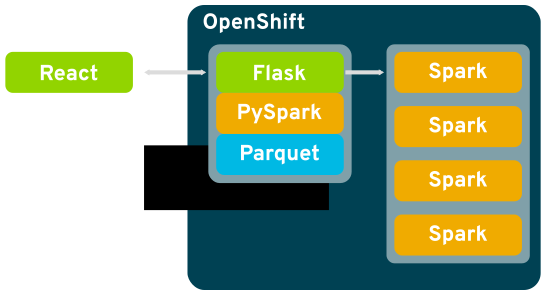

# var-sandbox

Value at Risk sandbox scaffolding application

This project is a mixed-mode Python Flask, React, and Apache Spark
application. As such it is slightly complicated to assemble and run. If you
you wish to try it out, the OpenShift deployment option is recommended as
the first pass. If you would prefer to dive into development or desire to run
the application outside of OpenShift, please see the local deployment
instructions.

## Basic architecture



## Deployment on OpenShift

The `openshift` directory contains a few templates for deploying the
var-sandbox into an OpenShift project. These templates are self explanatory
and create all the necessary objects to build and/or deploy the application.

Please note the image and repository locations that are encoded in the
templates, you will want to change these URLs to align with your needs.

The file `var-sandbox-setup-list.yaml` is the easiest to start with, it will
create all the necessary objects in your OpenShift project. It is designed
with the idea that you will build the application inside of OpenShift.

for a quick start, these steps will get you up and running:

```
oc create -f var-sandbox-setup-list.yaml
oc start-build var-sandbox
oc new-app --template var-sandbox
```

these commands will create the objects, start a build of the application, and
then launch it when finished. If all goes well you will have an exposed route
to your application.

The file `var-sandbox.yaml` is very similar to the other template but does
not include the build configuration. You should use this file if you wish to
consume the pregenerated images for the application and do not wish to build
the images in your OpenShift project. It can be started with the following
commands:

```
oc create -f var-sandbox.yaml
oc new-app --template var-sandbox
```

## Local deployment

These instructions are meant for developers and advanced users. If you are
building for local deployment you will need a copy of Apache Spark and the
`wikieod.parquet` file that is used by the application. The images referenced
in the quick start and the `Dockerfile` contain the necessary parquet data.

### Easy install

The easiest way to use this image is to create a container from the
Dockerfile and use that to access the application. This can be done most
simply with the following:

```
$ docker build -t var-sandbox .
... <build output> ...
$ docker run --rm -it -p 8080:8080 var-sandbox
```

Once running, access `http://127.0.0.1:8080/` with your browser.

### Advanced install

There are 2 main steps to running this project: compile the React components,
and run the Flask application.

To help automate these processes we recommend using a Python virtual
environment to setup the Flask requirements, and use the
[Yarn](https://yarnpkg.com) project to install and compile the React
components.

**Install the Python requirements**

```
$ pip install -r requirements.txt
```

**Install and build the React components**

```
$ yarn install
$ yarn run build
```

**Run the application with Yarn**

Before executing the devel run option, you need to provide 2 environment
variables, `SPARK_SUBMIT_CMD` and `WIKIEOD_FILE`.

```
$ export SPARK_SUBMIT_CMD=$HOME/opt/spark/bin/spark-submit
$ export WIKIEOD_FILE=$HOME/tmp/wikieod.parquet
$ yarn run devel
```

As before, visit `http://127.0.0.1:8080/` with your browser.
